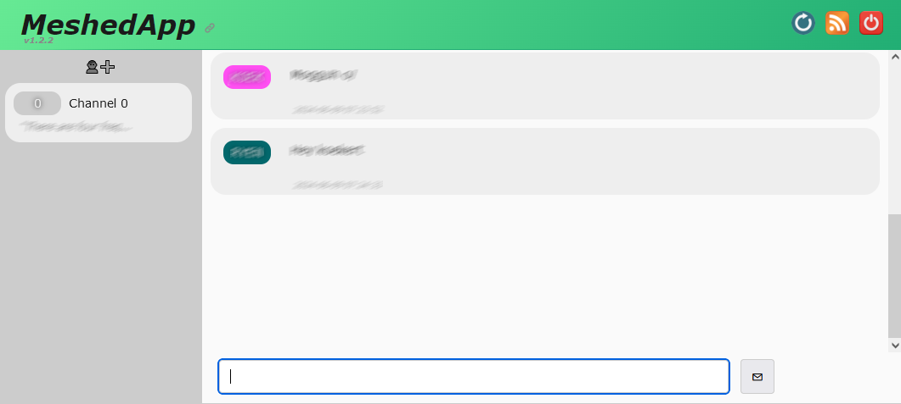

# MeshedApp

A simple self hosted web interface for your Meshtastic chat,  centrally hosted on your home server. 




## Index

* [Setup](#setup)
* [Docker](#docker)
* [Synology NAS](#synology-nas)

* [RSS](#rss)
* [Web browser notifications](#web-browser-notifications)
* [Auto response commands](#auto-response-commands)

## Setup

Example setup for RHEL9 based systems (AlmaLinux 9 / Rocky Linux 9)

```
dnf -y install git python3 python3-flask python3-pip python3-waitress
pip install meshtastic
git clone https://github.com/JCQ81/meshedapp.git
cd meshedapp
./meshedapp.py [meshtastic-device-ip] [meshedapp-url]
```

Now browse to [http://yourserver:6374](http://yourserver:6374)

## Docker

```
git clone https://github.com/JCQ81/meshedapp.git
cd meshedapp
docker build -t meshedapp .
docker run -d --name meshedapp -p 6374:6374 \
  -e TZ=Europe/Amsterdam \
  -e MESHTASTIC_HOST=192.168.0.1 \
  -v /path/to/store:/opt/meshedapp/store meshedapp
```

## Synology NAS

This guide has _only_ been tested on DiskStation Manager v7.1.1-42962

- Download the source as .zip, unpack it and upload the directory to your NAS
- From a terminal, run:

```
cd /path/to/meshedapp
python3 -m venv ./env
source ./env/bin/activate
python3 -m ensurepip
python3 -m pip install --upgrade pip
python3 -m pip install --upgrade meshtastic flask waitress
python3 ./meshedapp.py [meshtastic-device-ip]
```

## RSS

MeshedApp provides a simple RSS feed to notify on new messages. 
Feed URL: [http://yourserver:6374/rss](http://yourserver:6374/rss)

## Web browser notifications

Note that most web browsers only allow notifications on a secure server (https). To contact MeshedApp through a secure connection use a [Reverse proxy](https://en.wikipedia.org/wiki/Reverse_proxy)

## Auto response commands

For testing purposes MeshedApp supports a set of auto response commands. These commands can be sent from a _remote_ user to the MeshedApp backend, which will respond accordingly. All the commands send to your MeshedApp setup will be stored in a "virtual channel" (_/CMD_) for review.

| Command | Response |
|-|-|
| /ping | _...pong_ |
| /pong | _/ping_ (can result in another _...pong_ when both sides are running MeshedApp) |
| /echo _[text]_ | _[text]_ |
| /joke | A random joke |
